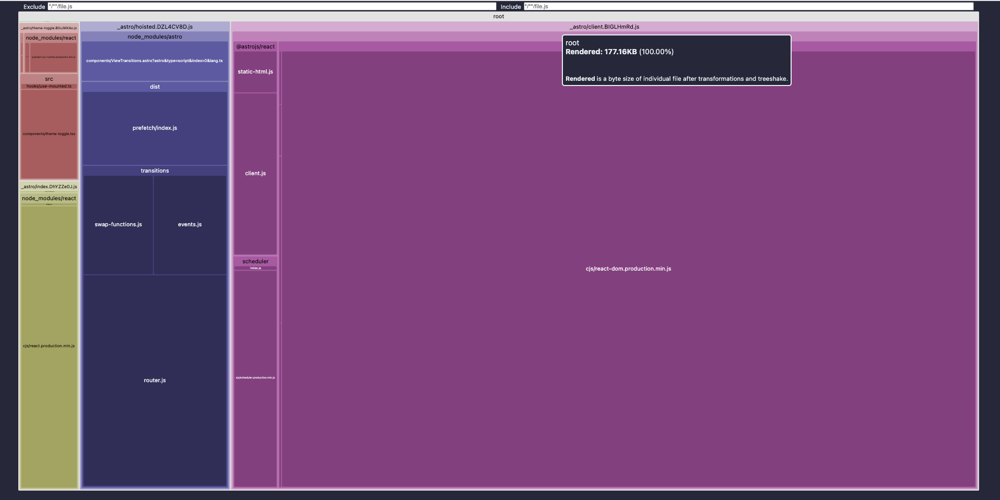

    this repo was used for leaning how astro works
    initial work was done by https://github.com/mickasmt/astro-nomy

# This repo can be a light weight starter for Astro-React-Radix-Tailwind.

    ├── public/
    │   └── fonts/
    ├── src/
    │   ├── components/
    │   ├── config/
    │   ├── content/
    │   ├── hooks/
    │   ├── icons/
    │   ├── layouts/
    │   ├── lib/
    │   ├── pages/
    │   ├── styles/
    │   └── types/
    ├── astro.config.mjs
    ├── README.md
    ├── package.json
    ├── tailwind.config.cjs
    └── tsconfig.json

## less than 500kb

## Component Diagram
